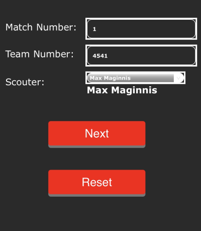
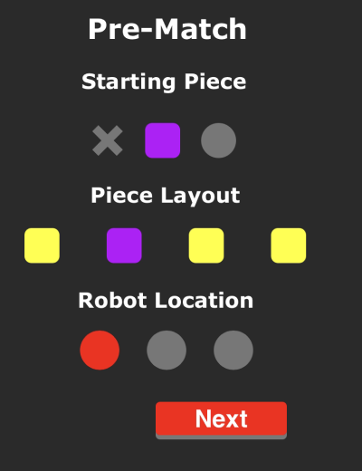
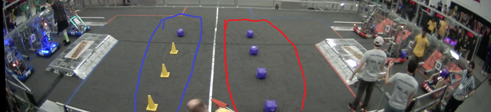
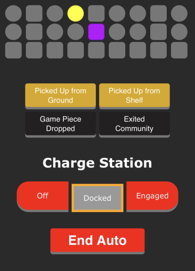
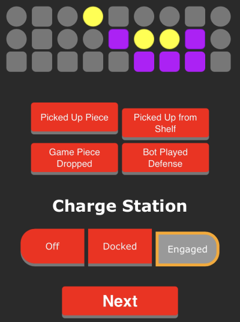
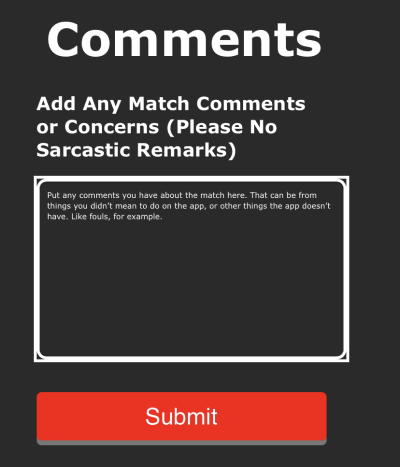

# ScoutingApp2023
Scouting App Code for the 2023 FRC Season

## Contact Info
hey, you, yes you, whoever you may be in the future, if you want to contact us or have any questions about the scouting app, do so by emailing us!

Max Maginnis : &emsp;`maxmaginnis@yahoo.com`

Jake Goodyear : &emsp;`jakengoodyear@gmail.com`

## Prerequisites
### Pypi Packages
- [`Flask`](https://pypi.org/project/Flask)
- [`google-api-python-client`](https://pypi.org/project/google-api-python-client)
- [`google-auth-httplib2`](https://pypi.org/project/google-auth-httplib2)
- [`google-auth-oauthlib`](https://pypi.org/project/google-auth-oauthlib)
- [`waitress`](https://pypi.org/project/waitress)

Install With
- Windows:  &emsp;`py -m pip install --upgrade Flask google-api-python-client google-auth-httplib2 google-auth-oauthlib waitress`
- Linux: &emsp;`python3 -m pip install --upgrade Flask google-api-python-client google-auth-httplib2 google-auth-oauthlib waitress`

## Setup
1. ### Pull repository
   `git pull https://github.com/cavineers/ScoutingApp2023`
2. ### Set up Google Sheets API and Credentials
   Follow (most of) this tutorial to help get everything set up: https://developers.google.com/sheets/api/quickstart/python

   2a. Setup OAuth for your Google Cloud Project and put the generated JSON in in file `comps/comp2023/apikeys.json`

      Diagram:
      ```
      {
         "Sheets OAuth": ...
      }
      ```
      - Sheets OAuth
          - The OAuth JSON generated by Google Cloud
          - type: `dict[str, str]`

   2b. During first runtime, click the OAuth concent link printed to the console
      - If you already did so and have generated the `comps/comp2023/token.json` file, this file can be moved into other instances of the app to use the same token.
      - Note: The token will eventually expire, so the `token.json` file must be deleted and regenerated with the OAuth concent link, and any copies must be replaced with the new token.

## Run
The following commands must be ran in the repository directory.

<br>

### Quickrun
Quickly run the flask app on `0.0.0.0:8000` with
- Windows:  &emsp;`py main.py`
- Linux: &emsp;`python3 main.py`

### Specify host IP and port
Specify IP and port to host with
- Windows:  &emsp;`py -m ScoutingApp.__main host=<ip> port=<port>`
- Linux: &emsp;`python3 -m ScoutingApp.__main host=<ip> port=<port>`

# Home page



## Match Number

Number of the match you will be scouting.

- Match Number: This is where you would add the match number you will be scouting. If it is a practice match, make it any number over 1000, and if its a qualifier match, just keep going up from whatever the last match was. (EX: if the last match was 80 and we're going into the qualifiers, put in 81, then 82, then 83 etc.)

## Team Number

The team that you will be scouting.

- Team Number: This is where you would add the team number you're scouting. (EX: if you're scouting team 686, you would put 686 into the team number.)

## Scouter

This is where you enter your name. You know who you are (hopefully).

- Scouter: This is where you would add your name when you're scouting. (EX: I'm Max Maginnis, so I would scroll down, find my name, and select it.)

# Prematch page

 

## Starting Piece

The piece your assigned robot will be starting with.

- Starting Piece: If the robot does not have a piece before the match starts, select the "X" buttton, If the robot has a cube before the match starts, select the "square" button, and if the robot has a cone before the match starts, select the "circle" button.

 

## Piece Layout

How the pieces on the field before the game starts are layed out.

- Piece Layout: The piece layout and robot location are difficult to explain, so I'll try my best. If you're scouting any of the robots on the blu team, you will be putting in "cone cone cone cube" or "yellow yellow yellow purple", and it you're scouting a robot on the red team, you will be putting in "cube cube cube cube" or "purple purple purple purple". The way you would put in where the pieces should be is driver oriented. By driver oriented I mean by how the driver would see it. So if we were a driver, we would be looking at the robot location (I'll be going over that next) and the piece layout, which if we were on the blu alliance, we would put in "cone cone cone cube", and if we were on the red alliance, we would put in "cube cube cube cube".

## Robot Location

Where your assigned robot will be located before the match.

- Robot Locations: The robot location is the same thing as the piece layout, but a bit easier. The robot location is also defined by the driver location. So if we were scouting on the red team and my robot was 7886, then I select the left red circle. If my robot was to the right, then I would select the right red circle.

# Auto page

 

## The Grid

REMINDER: only put on the grid what your assigned robot did.

- The Grid: The grid is used for tracking when your assigned robot put a piece on the grid. The squared are for cubes only, and the circles are for cones only. If you select one on the bottom row, a pop up will appear having the choices for "cube" or "cone" due to the bottom row allowing either cube or cone.

## Auto Buttons

Actions your assigned robot would be doing during auto.

- Picked Up from Ground: You would click this button when the robot pickes up a piece from the ground during auto.

- Picked Up from Shelf: You would click this button when the robot picks up a piece from the shelf during auto.

- Game Piece Dropped: You would click this button when the robot drops a piece during auto.

- Exited Community: You would click this button when the robot exits the community (the community is the red and blu lines right in front of the charging station.)

## Charging Station

The charging station has 3 different modes it could be on, Off, Docked, or Engaged.

- Charge Station OFF: If your assigned robot is not on the charging station, you will have the "off" button selected.

- Charge Satation DOCKED: If your assigned robot is on the charging station, but the lights are not on, you will have the "docked button selected.

- Charge Station ENGAGED: If your assigned robot is on the charging station and the lights are on, you will have the "engaged" button selected.

# Scout Page

 

## The Grid

REMINDER (again): only put on the grid what your assigned robot did.

- The Grid: The grid is used for tracking when your assigned robot put a piece on the grid. The squared are for cubes only, and the circles are for cones only. If you select one on the bottom row, a pop up will appear having the choices for "cube" or "cone" due to the bottom row allowing either cube or cone. (This grid will carry over anything you put in the auto grid btw)

## TeleOp Buttons

Actions your assigned robot would be doing during teleOp.

TeleOp is the phase after auto starts, basically the actual match.

- Picked Up Piece: You would click this button when the robot pickes up a piece during teleOp.

- Picked Up from Shelf: You would click this button when the robot picks up a piece from the shelf during teleOp.

- Game Piece Dropped: You would click this button when the robot drops a piece during teleOp.

- Bot Played Defense: You would click this button when the robot plays defense, like hitting another robot or blocks their way, not allowing them to get any cubes or cones from the shelf.

## Charging Station

The charging station has 3 different modes it could be on, Off, Docked, or Engaged.

- Charge Station OFF: If your assigned robot is not on the charging station, you will have the "off" button selected.

- Charge Satation DOCKED: If your assigned robot is on the charging station, but the lights are not on, you will have the "docked button selected.

- Charge Station ENGAGED: If your assigned robot is on the charging station and the lights are on, you will have the "engaged" button selected.

# Results Page

 

## Comments

Where your extra comments go.

- Comments: This is where you put your comments you have about the match. That can be from things you didn't mean to do on the app, like mark the robot as not on the charging station, even though it was, or other things the app doesn't provide. Like fouls, for example.

## Submit The Data

Where you submit the data.

- Submit: This is where you submit all of your data into the google sheet we use. Once you press the "Submit" button, you will be sent back to the "Home Page". Also make sure to point out your assigned robot's strength's and weaknesses (I can't say this enought). After that, you can keep scouting for any later matches.

# Other

Do not delete the coconut -Maginnis and Goodyear
